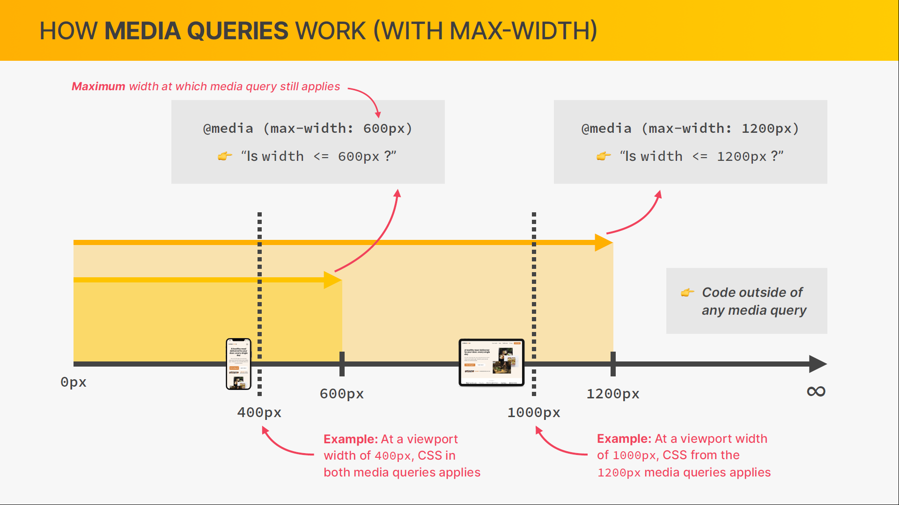

# Omnifood Project — Responsive Web Design

## How Media Queries Work



For desktop-first dev, we'd use max-width.  
For mobile-first dev, we'd use min-width.

We call `@media (max-width: 600px)` a **Media Query**.

The CSS code inside of `@media (max-width: 600px)` will only be applied if the current `viewport width` is less than or equal to 600px. (We can think of max-width as the maximum width at which the media query is still effective.)

Note that the code inside of media query is just for overwriting specific parts of CSS at certain viewport width, the rest of CSS code still applies.

In the example above, at 400px both media queries apply, and if we have conflicting CSS declarations (which is very common), than the one **appears latter in the code will apply**.

We write the CSS rules for a certain viewport width **inside** of the code block of the media query.

---

## How to Select Breakpoints

![Breakpoints]

BAD: Write media queries based on width of popular devices.

GOOD: Write media queries based on **most used width ranges** for different categories of devices, and pick the breakpoints as the width in between these categories.

BEST: When our **design breaks down**. For desktop-first dev, we decrease our viewport width, and as soon as our design breaks, we create a new breakpoint.

We usually combine GOOD and BEST together.

### RULE OF THUMB

Media queries should account for a range of at least 200~300px for a certain type of device, and then we can move on to the next device range.

Don't add a media query for every single design flow that appears as we decrease the width, that's just not practical.

---

## Responding to Small Laptops

Without the following, the responsive design will not work on mobile devices (phones and tablets). Since bowsers on mobile devices will zoom the page out by default until it fits the screen.

See more: [Stackoverflow](https://stackoverflow.com/questions/61238548/side-effects-of-removing-width-device-width-from-viewport-meta-tag-when-initi)

```html
<!-- Always include this line of code -->
<meta name="viewport" content="width=device-width, initial-scale=1.0" />
```

### unit

Don't use px in media queries. (since it doesn't adjust to user's font-size or zoom level.)

`rem` and `em` do NOT depend on html font-size in media queries! Instead, `1rem = 1em = 16px`.

`rem` and `em` inside media queries (the max-width property), they always take the default value of the browser's font-size settting.

**IMPORTANT**: Don't use `rem` in media queries (for the max-width unit), since it has bugs in some browsers (safari especially). Use `em` for media queries instead.

See: [article](https://zellwk.com/blog/media-query-units/)

### Start writing

Note `rem` still works the same inside of the media query block.

---

## Note

1. Why use `rem` on `body`?

   Since `rem` unit only takes its value from the root font size, which is the `<html>` element. But `em` unit takes its value from its parent's font-size, so if we set `1.3 em` on each element of nested elements, then the font-size for each element is their parent's font-size times 1.3, which will cause the font-size to keep being multiplied, which is not what we want (set them all to the same size).

2. Why em and rem work different in media queries and normal CSS?

   Since otherwise it will create an infinite loop, consider this:

   ```css
   body {
     font-size: 10000px;
   }
   @media (min-width: 1em) {
     body {
       font-size: 1px;
     }
   }
   ```

   1em would be gigantic, so the media query would match, so 1em would be small, so the media query wouldn't match, so 1em would be gigantic, so...

   Thus, **in media queries, `rem` and `em` are both relative to the browser's default setting.**

---

## Responding to Landscape Tablets

We can now simply change `font-size` in html element and change all sizing!

Note that we still assume `1rem = 10px` when re-designing the layout size. Since when we want to redesign the value of some sizing, we might think it's too big for example, then we can just assume it works the same, but we want to go 1 step down the font-size value chart.

For example, if we think 5.2rem is too big, just go lower than 5.2 rem, since if we are really thinking it's too big, and this has nothing to do with the html font-size setting. Thus, we can just imagine all unit converts the same as before, and use that to change the font-size by relative feeling.

---

## Responding to Portrait Tablets

---

## Building the Mobile Navigation

### Note

1. Introduces the attribute selector:

   ```css
   .icon-mobile-nav[name='close-outline'] {
     display: none;
   }
   ```

2. We can NOT have transition animations when `display: none` is set, therefore we can NOT simply set `display` to `none` for hiding the navigation.

3. If we can't simply use `display: none;`, then we'll need some extra steps to achieve it, since with display set to none, the element is really not in the page anymore, but if we used `opacity: 0;` the element is actually still there, just not visible (keyboard like "tabs" can still access the links).

   ```css
   .hidden {
     /* 1) Hide it visually */
     opacity: 0;

     /* 2) Make it unacessible (to mouse and keyboard) */
     pointer-events: none;

     /* 3) Hide it from screen readers */
     visibility: hidden;
   }
   ```

   (`pointer-events` is actually only used for this purpose, so no need to memorize this, just copy this code when needed to create a `hidden` class)

4. Here, instead of having a hidden class, we're using a open class for mobiles, and we can simply select all related elements to the opened navigation by using the descendent selector with `.nav-open` being the parent element, like this:

   ```css
   .nav-open .main-nav {
     opacity: 1;
     pointer-events: auto;
     visibility: visible;
   }

   .nav-open .icon-mobile-nav[name='close-outline'] {
     display: block;
   }

   .nav-open .icon-mobile-nav[name='menu-outline'] {
     display: none;
   }
   ```

   This way, we can simply create animation by adding/removing the `nav-open` class using JavaScript.

5. We can set the `overflow-x: hidden` on `<html>` and `<body>` to disable any vertical scrolling (to hide the extra empty space our translated navigation occupies secretly).

   ```css
   html {
     /* font-size: 10px; */
     /* 10px / 16px = 62.5% */
     /* Percentage of user's browser font-size setting */
     font-size: 62.5%;
     overflow-x: hidden;
   }

   body {
     font-family: 'Rubik', sans-serif;
     line-height: 1;
     font-weight: 400;
     color: #555;

     /* Only works if there is nothing absolutely positioned in relation to body */
     overflow-x: hidden;
   }
   ```

6. We often use `opacity` and `transform` for animations, since they create more smooth animations.

7. There's a third value we can specify for the `transition` property,

   ```css
   .someClass {
     transition: all 0.5s ease-in;
   }
   ```

### Note 2

1. Another way to achieve this navigation, is to create an entire new navigation to show for the mobile. Just like we did in JavaScript course.

---

## Responding to Smaller Tablets

### Note

1. Since 3 and 4 columns grid are becoming to big to fit the page, so we'll set them both to 2 columns instead,

   ```css
   .grid--3-cols,
   .grid--4-cols {
     grid-template-columns: repeat(2, 1fr);
   }
   ```

2. To build a grid that's not symmetric between columns or rows, we can use the least common multiple of those numbers. For example, for the footer we want 3 columns at 1st row, and 2 columns at 2nd row, but they should all be symmetric to each row, so we have to somehow make the 2 columns take the same room as 3 columns, we can instead use a 6 column grid for this:

   ```css
   .grid--footer {
     grid-template-columns: repeat(6, 1fr);
   }

   .logo-col,
   .address-col {
     grid-column: span 3;
   }

   .nav-col {
     grid-row: 1;
     grid-column: span 2;
     margin-bottom: 3.2rem;
   }
   ```

---

## Responding to Phones

### Note

1. devtool has a **"show media quiries"** option on the top-right corner.

2. We commonly add a breakpoint at `600px` for phones, but in this project, since we already have a breakpoint at `700px`, so we can go a bit smaller then 600. Here we chose somewhere about `570px`.

3. Recall that the `nth-child(n)` is really the `n`th child of its parent container, so it also counts its siblings as one of its parent's child.

4. Note that in grids, if an `img` is side by side with something that has content, and we've set the `grid-template-columns` to be `1fr 1fr`, then the `img` though have no content, but it still gets its height, since we've assigned it by `grid-template-columns`. BUT if it's no longer side by side, then the image will dissapear, in that case we need to manually assign height to it.
