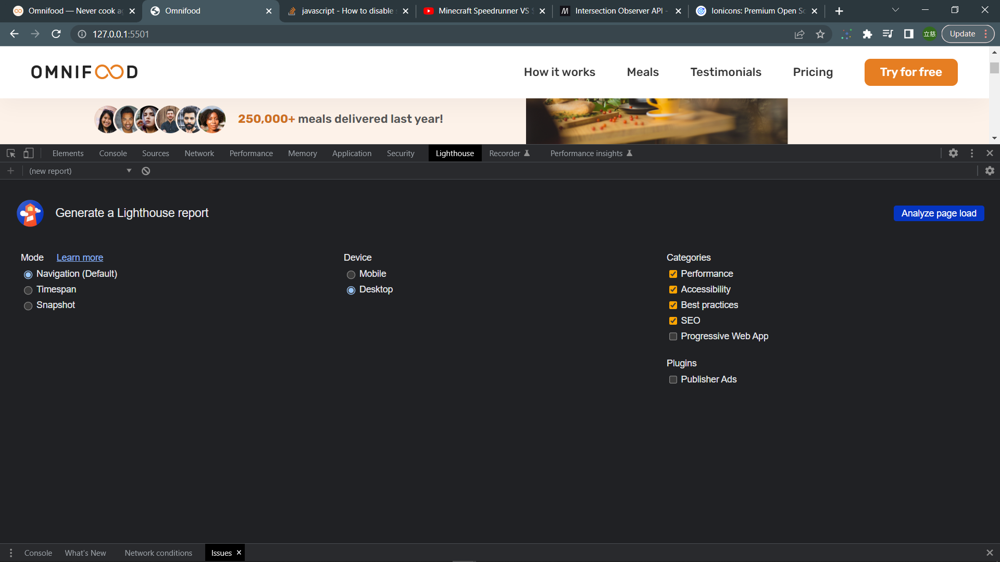

# Omnifood Project Optimizations

## Making Mobile Navigation Work

### Note

1. We want to make sure the mobile-nav-button is on top of everything else, so it will be clickable no matter what. We can set a large z-index for it:

   ```css
   .btn-mobile-nav {
     display: block;
     z-index: 9999;
   }
   ```

---

## Implemeting Smooth Scrolling

### Note

1. Making the links work on html, with `id="idName"` on the directed element and `href="#idName"` on the anchor element.

2. Actually for chrome, we can easily create smooth scrolling using CSS only, without JavaScript. Like this:

   ```css
   html {
     scroll-behavior: smooth;
   }
   ```

   However, safari engine does NOT support this animation (including chrome on iphones, since they behind the scenes uses the same engine as safari does), therefore, we'd need JavaScript to do this.

3. What's the default action of a `<a>` tag, why do we need `e.preventDefault()` to stop it???

   See this: [default-action-of-anchors](https://stackoverflow.com/questions/44758654/what-is-the-default-action-of-a-tag)

4. The following does NOT work in safari:

   ```js
   if (href === '#') {
     window.scrollTo({
       top: 0,
       behavior: 'smooth',
     });
   }
   ```

   To fix this, we'll need to include a extra smoothscroll-polyfill to our html head, just before all our internal JavaScript files, like this:

   ```html
   <script
     defer
     src="https://unpkg.com/smoothscroll-polyfill@0.4.4/dist/smoothscroll.min.js"
   ></script>
   ```

### Example

```js
const allLinks = document.querySelectorAll('a:link');

allLinks.forEach((link) => {
  link.addEventListener('click', function (e) {
    e.preventDefault();
    const href = this.getAttribute('href');

    // Scoll to top
    if (href === '#') {
      window.scrollTo({
        top: 0,
        behavior: 'smooth',
      });
    }

    // Scroll to internal links
    // (We can of course use "else-if", and we won't need
    // href !== '#', but using multiple "if" is more modern)
    if (href !== '#' && href.startsWith('#')) {
      const destinationElement = document.querySelector(href);
      destinationElement.scrollIntoView({ behavior: 'smooth' });
    }

    // Close mobile navigation
    header.classList.remove('nav-open');
  });
});
```

Using event delegation:

```js
// Using event delegation
document.body.addEventListener('click', function (e) {
  const link = e.target.closest('a:link');

  if (!link) return;

  // If it's link, then prevent default and get href
  e.preventDefault();
  const href = link.getAttribute('href');

  // Scroll back to top
  if (href === '#') {
    window.scrollTo({
      top: 0,
      behavior: 'smooth',
    });
  }

  // Scroll to internal links
  if (href !== '#' && href.startsWith('#')) {
    const destinationEl = document.querySelector(href);
    destinationEl.scrollIntoView({ behavior: 'smooth' });
  }

  // Close mobile navigation
  header.classList.remove('nav-open');
});
```

---

## Sticky Navigation Bar

### Note

1. We can add the following sticky class to the header:

   ```css
   /* STICKY NAVIGATION */
   .sticky {
     position: fixed;
     top: 0;
     width: 100%;
     height: 8rem;
     background-color: #fff;
     box-shadow: 0 1.2rem 3.2rem rgba(0, 0, 0, 0.04);
     z-index: 999;

     /* Jonas added these properties too */
     /* But after testing I think these have no effect */
     bottom: 0;
     padding-top: 0;
     padding-bottom: 0;
   }
   ```

   The real important thing here are

   - `position: fixed`: fix our navigation

   - `top: 0`: determines our sticky nav's position in the viewport

   - `height: 8rem`: So we can have padding, otherwise all content in navigation will have only their content's height.

   - `z-index: 999`: To let nav float above other content in the page, but not higher than mobile navigation's `z-index: 9999`.

   - `width: 100%`: For the content to occupy whole horizontal width.

   - `box-shadow: 0 1.2rem 3.2rem rgba(0, 0, 0, 0.04);`: Just in case sticky nav has the same color as rest of page, which might be difficult to tell where's the nav.

2. Notice when the manually typed height of navigation is for us to use that in the options `rootMargin` property, but it's really a BAD solution, too manual, the one from Bankist app is BETTER.

   Here, since the sticky navigation is taken out of the flow and hence lost its height, so when we leave hero section, and the navigation becomes sticky, the whole `section-hero` will move up the original height of the non-sticky navigation, so we'll need to manually also account for that height by using `margin-top` on the `section-hero`.

### My solution

Instead of manually typing the height, and margin-top of section-hero, we can use the following JavaScript code.

`sticky--helper` is just a helper class that sets `margin-top: 9.6rem`, recall that `9.6rem` is the height of original navigation. Of course we could also have set the `margin-top` manually in JavaScript like this:

```js
sectionHero.style.marginTop = `${navHeight}px`;
```

Both works fine, and although the above solution is more dynamic, but I think that using a `sticky--helper` class just looks a little cleaner and concise.

```js
const navHeight = header.getBoundingClientRect().height;
const stickyNavHeight = navHeight * (8 / 9.6); // 8rem / 9.6rem

const stickyCallback = function (entries) {
  entries.forEach((entry) => {
    if (!entry.isIntersecting) {
      header.classList.add('sticky');
      sectionHero.classList.add('sticky--helper');
    } else {
      header.classList.remove('sticky');
      sectionHero.classList.remove('sticky--helper');
    }
  });
};

const options = {
  root: null,
  threshold: 0,
  rootMargin: `-${stickyNavHeight}px`,
};

const observer = new IntersectionObserver(stickyCallback, options);
observer.observe(sectionHero);
```

---

## Browser Support and Fixing Flexbox Gap in Safari

### Note

1. **TEST AND OPTIMIZE**

   - Make sure website works in **all major browsers** (Chrome, Firefox, Safari, Edge, maybe even IE, but for our own project, that shouldn't be too concerned, just ignore IE).

   - Test the website on **actual mobile devices**, not just in DevTools.

   - Optimize all **images**, in terms of dimensions and file size (See lecture note on images)

   - Fix simple **accessibility** problems (e.g. color contrast issues)

   - Run the **Lighthouse** performance test in Chrome DevTools and try to fix reported issues.

   - Think about **Search Engine Optimization** (SEO)

2. Check whether a CSS property is supported on some browsers: [caniuse](https://caniuse.com/)

3. **CSS Vendor Prefixes**: Some properties are only supported with certain prefix. For example, the `backdrop-filter` is supported on Safari only with prefix `-webkit-`. There are also some different prefixes like `-o-`, `-moz-`, etc. for different browsers. See more: [here](https://flaviocopes.com/css-vendor-prefixes/)

4. Old Safari version used to NOT support flexbox `gap` property, we can use the following JavaScript code to check whether current browser supports flexbox gap:

   ```js
   const checkFlexGap = function () {
     const flex = document.createElement('div');
     flex.style.display = 'flex';
     flex.style.flexDirection = 'column';
     flex.style.rowGap = '1px';

     flex.appendChild(document.createElement('div'));
     flex.appendChild(document.createElement('div'));

     document.body.appendChild(flex);
     const isSupported = flex.scrollHeight === 1;
     flex.parentNode.removeChild(flex);

     if (!isSupported) document.body.classList.add('no-flexbox-gap');
   };
   checkFlexGap();
   ```

   If it's not supported, then it will add the class `no-flexbox-gap` to `<body>`, then we'll need to rewrite all `flexbox gap` property using `margin`s, for example:

   ```css
   .no-flexbox-gap .main-nav-list li:not(:last-child) {
     margin-right: 4.8rem;
   }

   .no-flexbox-gap .list-item:not(:last-child) {
     margin-bottom: 1.6rem;
   }

   .no-flexbox-gap .list-icon:not(:last-child) {
     margin-right: 1.6rem;
   }

   .no-flexbox-gap .delivered-faces {
     margin-right: 1.6rem;
   }

   .no-flexbox-gap .meal-attribute:not(:last-child) {
     margin-bottom: 2rem;
   }

   .no-flexbox-gap .meal-icon {
     margin-right: 1.6rem;
   }

   .no-flexbox-gap .footer-row div:not(:last-child) {
     margin-right: 6.4rem;
   }

   .no-flexbox-gap .social-links li:not(:last-child) {
     margin-right: 2.4rem;
   }

   .no-flexbox-gap .footer-nav li:not(:last-child) {
     margin-bottom: 2.4rem;
   }

   @media (max-width: 75em) {
     .no-flexbox-gap .main-nav-list li:not(:last-child) {
       margin-right: 3.2rem;
     }
   }

   @media (max-width: 59em) {
     .no-flexbox-gap .main-nav-list li:not(:last-child) {
       margin-right: 0;
       margin-bottom: 4.8rem;
     }
   }
   ```

   Note that of course we can rewrite the same media queries in the above example.

---

## Testing Performance with Lighthouse

### Note

1. We can run a **Lighthouse** test in the DevTool, just choose the categories (no need for Progressive Web App for our project), and choose device, then just press "Analyze page load".

2.The **actual Performance** will need to be tested **_after_** we deployed our website, since right now we're still on our local website which is really fast to load.

3. 

---

## Adding Favicon and Meta Description

### Note

1. We can add a meta description like this:

   ```html
   <meta
     name="description"
     content="Omnifood is an AI-powered food subscription that will make you eat healthy again, 365 days per year. It's tailored to your personal tastes and nutritional needs."
   />
   ```

   The `content` is what will appear to the Search Engine, so writing a descriptive sentence is important.

2. **IMPORTANT**: Always add our own **_favicon_**, do NOT leave the default browser icon, which looks terrible. We can add it like this:

   ```html
   <link rel="icon" href="img/favicon.png" />
   ```

3. On mobile and IOS, the operating system allow users to add a page to favorite, which will need a icon for them too!!!

   - For Apple: Use icon image of size `180 x 180`, and add it like this

     ```html
     <link rel="apple-touch-icon" href="img/apple-touch-icon-180.png" />
     ```

   - For Android: We need a extra file called `manifest.webmanifest`, which is a file extension that's used for Android to recognize the different favicons. And in that file we write something like this:

     ```webmanifest
     {
       "icons": [
         {
           "src": "img/favicon-192.png",
           "type": "image/png",
           "sizes": "192x192"
         },
         {
           "src": "img/favicon-512.png",
           "type": "image/png",
           "sizes": "512x512"
         }
       ]
     }
     ```

     And we add the following in our html head:

     ```html
     <link rel="manifest" href="manifest.webmanifest" />
     ```

---

## Image Optimizations

### Note

1. Process of sizing an image:

   - Step 1: Get the image we want (high-res is better, usually 1000px+ is good, but depends on our largest required image size).

   - Step 2: Determine the largest image size we'll need to render on page. For example, the largest size for the "step-img" is `188px` on the screen.

   - Step 3: Resize the image to 2x or 3x the size of largest rendered size in step2. For example, `188px` will actually need a `376px` to `564px` size. (recall this is because modern high-res screens usually use 2 or 3 pixels to display 1px on screen.) Here we just choose `400px`.

2. We still need to compress the images on our website. For that we can use [squoosh](https://squoosh.app/). And just play around with the options to get our desired effect (lower size but also good quality)

3. Note that with file type `jpeg` we can't have the **transparent** part of image, which is NOT what we want. So just choose `png` type of image to compress. Or even BETTER: use the newest image type `webp` which allow us to compress more size!!! So now we have this:

   ```html
   <div class="hero-img-box">
     <!--  -->
     
   </div>
   ```

4. But note that the `webp` image type is not supported in ALL browsers. In fact, safari just recently (8, 2022) released the neweset version that supports `webp`, so any older version only has partial support.

   So, we'll need a new tag called `<picture>` (The picture element is a container which provides multiple sources to its contained img element to allow authors to declaratively control or give hints to the user agent about which image resource to use). So instead of the example above, we can improve it to this:

   ```html
   <div class="hero-img-box">
     <picture>
       <source srcset="img/hero.webp" type="image/webp" />
       <source srcset="img/hero-min.png" type="image/png" />
       
     </picture>
   </div>
   ```

   Basically, if the browser support `<source>`, then the following ``'s `src` attribute will be the path given in `<source>`. And note that we have 2 `<source>`, since the browser will automatically determine which source it can use and works the best.

   Note in the `` we still use the `src="img/hero-min.png"` just in case the browser doesn't support `<source>` element, so in those cases, we'll simply use `src="img/hero-min.png"`, which is supported on all browsers.

---

## Deployment to Netlify && Making the Form Work with Netlify

### Note

1. Some options to purchase domains: "hover", "godaddy", "namecheap"

2. We can use Netlify to receive forms by adding a `name="sign-up"` and `netlify` attribute to our `<form>` like this:

   ```html
   <form class="cta-form" name="sign-up" netlify></form>
   ```

   Also, don't forget the `name=""` attribute for `<input>` fields in the form, since that's how the backend get access to the inputs.

3. Reminder: Do NOT use Netlify for submitting passwords (although we can pay netlify for that service, but it's not recommended).

4. Now, we can check all form submission in Netlify --> omnifood-bretonyang --> Forms
